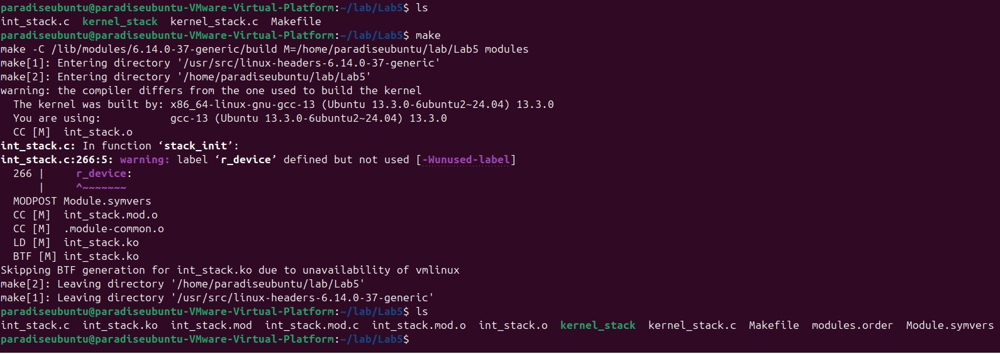
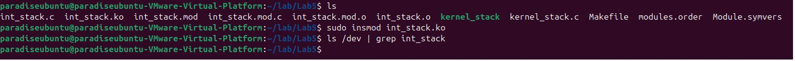
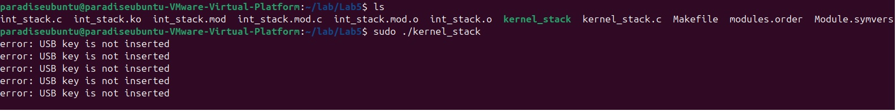
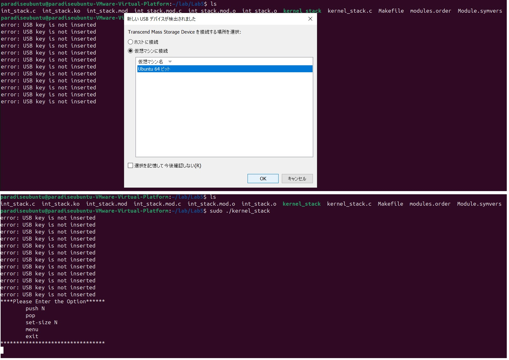
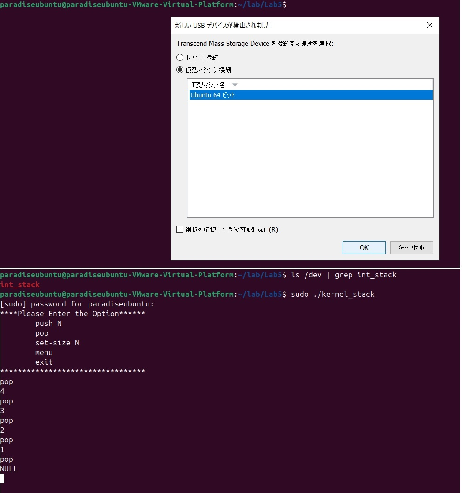
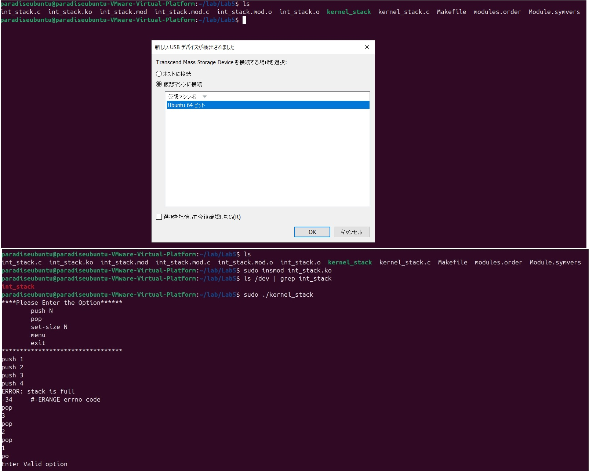

# Character Device Driver (+USB)

### Task:
#### Part 1
---
- Необходимо реализовать модуль ядра [*chardev*](https://tldp.org/LDP/lkmpg/2.6/html/x569.html "Character Device Drivers") с именем **int_stack.ko**. Этот модуль ядра должен реализовать 
  структуру данных **stack\<integer\>** с операциями **push/pop** и поддерживать конфигурацию размера стека через **ioctl**.
* Реализовать структуры данных стека:
  * Используя динамическое выделение памяти
  * Используя механизмы синхронизации для поддержки многопоточного доступа 
    (т.е. решить классическую задачу [*readers-writers problem*](https://en.wikipedia.org/wiki/Readers%E2%80%93writers_problem "Readers–writers problem"))
* Реализовать следующие file_operations:
  * open() и release() — инициализация и деинициализация стека
  * read() — операция pop
  * write() — операция push
  * ioctl() — конфигурация максимального размера стека
* Коды ошибок должны ТОЧНО соответствовать описанным в руководстве stack(3) (раздел Return codes):
  * Pop из пустого стека → вернуть NULL
  * Push в полный стек → вернуть -ERANGE (коды ошибок должны быть отрицательными в соответствии со стилем кодирования 
    модулей ядра, см. документацию)
  * Коды ошибок ioctl() также описаны в соответствующем [*руководстве*](https://man7.org/linux/man-pages/man2/ioctl.2.html "ioctl(2) — Linux manual page")

- Важно: Обеспечить правильную обработку всех граничных случаев (пустой стек, полный стек и т.д.)
---
#### Part 2
---
Реализовать небольшую пользовательскую утилиту **kernel_stack**, которая оборачивает функциональность вашего модуля в 
следующий удобный для пользователя CLI (интерфейс командной строки).  
*Example for CLI*: 
```bash 
$ kernel_stack set-size 2  
$ kernel_stack push 1  
$ kernel_stack push 2  
$ kernel_stack push 3  
ERROR: stack is full  
$ kernel_stack pop   
2  
$ kernel_stack pop   
1  
$ kernel_stack pop  
NULL
$ kernel_stack set-size 0
ERROR: size should be > 0
$ kernel_stack set-size -1
ERROR: size should be > 0
$ kernel_stack set-size 2
$ kernel_stack push 1
$ kernel_stack push 2
$ kernel_stack push 3
ERROR: stack is full
$ echo $?
-34        # -ERANGE errno code
```

---
#### Part 3
- Сначала реализуйте Part 1 (на ее основе делается Part 3).
- Добавьте любое USB-устройство в качестве электронного ключа для вашего символьного устройства (Part 1). 
  Вы можете использовать любой VID/PID: мышь, клавиатуру, USB-накопитель и т.д.
- Символьное устройство (из Part 1) не должно появляться в системе, если электронный ключ не вставлен в USB-порт.
- При удалении USB-устройства (из Part 1) символьное устройство также должно быть удалено из списка /dev, но 
  **стек не должен быть уничтожен**.
- Добавьте сообщение об ошибке *“error: USB key is not inserted”* в пользовательское приложение-обертку 
  (**kernel_stack**) из Part 2.

---
### Notes:
В данном репозитории вы НЕ найдете подробного описания о том:
- как создать Character Device Driver
- как создать свой модуль для ядра Linux

Обо всем этом можно почитать в следующих замечательных статьях, которыми я, к слову, тоже руководствовался:
- [*Пособие по программированию модулей ядра Linux. (серия статей)*](https://habr.com/ru/companies/ruvds/articles/681880/ "Пособие по программированию модулей ядра Linux. Ч.1")
- [*Основы файловой системы Linux - file, dentry и inode в VFS - очень подробная статья*](https://russianblogs.com/article/98631148139/ "Основы файловой системы Linux - file, dentry и inode в VFS - очень подробная статья")
- [*Пишем файловую систему в ядре Linux*](https://habr.com/ru/companies/JetBrains-education/articles/218833/ "Пишем файловую систему в ядре Linux")
- [*Device File Creation – Linux Device Driver Tutorial Part 5*](https://embetronicx.com/tutorials/linux/device-drivers/device-file-creation-for-character-drivers/ "Device File Creation – Linux Device Driver Tutorial Part 5")
### Solution:

---
#### Part 1 (Stack)
Для данной задачи, была выбрана реализация стека в качестве связного списка. Для этого нам подадобится создать
простую структуру Node, которая будет хранить само значение и указатель на предыдущий элемент. 
Переменная **stack_real_size** будет отвечать за контроль количества создаваемых Node:
```C
#define DEFAULT_SIZE 3

static int stack_size = DEFAULT_SIZE;
static int stack_real_size = 0;

typedef int T;

typedef struct Node_t {
    T value;
    struct Node_t *prev;
}
Node;

static Node *head;
```
Сами Node будем создавать в функии write() она же push и освобождать память в функции read() она же pop.
Возможно, не самая оптимальная реализация в данном случае, так как при каждом вызове push будет выделяться память,
а при каждом вызове pop память будет осовобождаться. Однако, в такой реализации мы освобождаем себя от реализации
функций open() и release() нашего Character Device Driver, которые вызываются когда происходит первое обращение к нашему
Character Device Driver (open()) и при освобождении файловой структуры (release()). Так же такой подход позволит не
добавлять много кода в функции __init и __exit, которые вызываются при загрузке (insmod) / выгрузке (rmmod) модуля 
ядра Linux. 

**write**:
```C
static ssize_t stack_write(struct file *filp,
    const char __user *buf, size_t len, loff_t *off) {
    T value;
    Node *tmp;

    if (stack_real_size >= stack_size) {
        return -ERANGE;
    }

    if (len != sizeof(T)) {
        return -EINVAL;
    }

    if (copy_from_user(&value, buf, len)) {
        return -EFAULT;
    }

    spin_lock(&stack_spinlock);
    if ((tmp = kmalloc(sizeof(Node), GFP_KERNEL)) == 0) {
        printk(KERN_INFO "Cannot allocate memory in kernel\n");
        return -ENOMEM;
    }

    tmp->value = value;
    tmp->prev = head;

    head = tmp;
    stack_real_size++;
    spin_unlock(&stack_spinlock);

    return len;
}
```

**read**:
```C
static ssize_t stack_read(struct file *filp, char __user *buf, size_t len, loff_t *off) {
    T value;
    Node *out;

    if (head == NULL) {
        return -1;
    }

    spin_lock(&stack_spinlock);
    out = head;
    head = head->prev;
    value = out->value;

    if (copy_to_user(buf, &value, sizeof(T))) {
        return -EFAULT;
    }

    kfree(out);
    stack_real_size--;
    spin_unlock(&stack_spinlock);

    return sizeof(T);
}
```

Как видно из кода **stack_real_size** в первом случае используем для контроля переполнения (STACK_OVERFLOW) 
```if (stack_real_size >= stack_size)``` и не забываем инкрементировать после успешного создания Node 
```stack_real_size++;```. В случае с read, от STACK_UNDERFLOW уберегает ```if (head == NULL)```, который 
проинициализирован в __init (можно было и в другом месте, так же вместо проверки head, можно было бы проверять 
stack_real_size == 0, но с head надежнее). Разумеется, после освобождения памяти, не забываем сделать 
```stack_real_size--;```.

Блокировки как уже можно заметить реализованы с помощью Spinnig locks. Более подробно про блокировки в ядре Linux
можно почитать [*тут*](https://docs.kernel.org/locking/locktypes.html "Lock types and their rules").
Проинициализирован наш **stack_spinlock** был чуть раньше, а именно в строке  ```DEFINE_SPINLOCK(stack_spinlock);```, это
автоматический варинат инициализации при помощи макроса, так же можно и в ручную. Если кратко, то **spinlock_t** очень похож
на **semaphore** с одним разрешением, только в отличие от второго он потребляет ресурсы процессора при ожидании разблокировки,
но при этом дает возможность использовать его в контексет прерываний. 

**ioctl**:
```C
#define SET_SIZE _IOW('a', 'a', int * )

static long stack_ioctl(struct file *file, unsigned int cmd, unsigned long arg) {
    switch (cmd) {
    case SET_SIZE:
        int new_size;

        if (copy_from_user(&new_size, (int *) arg, sizeof(int))) {
            return -EFAULT;
        }
        if (new_size <= 0) {
            return -EINVAL;
        }

        spin_lock(&stack_spinlock);
        stack_size = new_size;
        if (new_size < stack_real_size) {
            int offset = stack_real_size - new_size;
            Node *old;
            while (offset > 0) {
                old = head;
                head = head->prev;
                kfree(old);
                offset--;
                stack_real_size--;
            }
        }
        spin_unlock(&stack_spinlock);
        break;
    default:
        break;
    }
    return 0;
}
```
В ioctl, при помощи которой мы будем изменять размер стека, все так же используется **Spinnig locks (spinlock_t)**.
Я решил освобождать память в случае, когда новый размер стека будет меньше чем реальное количество 
созданных Node: ```if (new_size < stack_real_size)```. В целом, память здесь можно было бы и не освобождать, так как
в __exit, которая будет выполняться при вызове rmmode, как это уже говорилось раньше, я так же освобождаю всю 
использованную память в случае если она была выделена.

**Build module**:

Модуль собирается простым **Makefile**:
```bash
obj-m := int_stack.o

all:
	make -C /lib/modules/$(shell uname -r)/build M=$(PWD) modules
clean:
	make -C /lib/modules/$(shell uname -r)/build M=$(PWD) clean
```
Загрузить можно командой:
```bash
sudo insmod int_stack.ko
```
Выгрузить:
```bash
sudo rmmod int_stack.ko
```

#### Mini summary:
В целом, на этом требуемый функционал для **Part 1** реализован, полный код можно найти в **int_stack.c** и **Makefile**.
Далее немного перепрыгнем **Part 2 (CLI)**  и обсудим сперва **Part 3** тобишь прикрутим **USB**, а затем кратко осветим 
**CLI** и посмотрим примеры запуска. 

---
#### Part 3 (USB)
Опять же более подробно о создании USB Device Driver можно почитать [*тут*](https://embetronicx.com/tutorials/linux/device-drivers/usb-device-driver-basics/ "USB Device Driver Basics 1 – Linux Device Driver Tutorial Part 33") 
и [*тут*](https://embetronicx.com/tutorials/linux/device-drivers/usb-device-driver-example/ "USB Device Driver Example – Linux Device Driver Tutorial Part 34").

В нашем же случае, чтобы добавить **USB-устройство** (возьмем обычный USB-накопитель) **в качестве электронного ключа для 
начешего Character Device Driver**, будет достаточно добавить следующий код (который кстати говоря уже есть в 
int_stack.c):
```C
#define USB_VENDOR_ID  (0x8564) //USB device's vendor ID
#define USB_PRODUCT_ID (0x1000) //USB device's product ID

static int stack_usb_probe(struct usb_interface *interface, const struct usb_device_id *id) {
    /*Creating device*/
    if (IS_ERR(device_create(dev_class, NULL, dev, NULL, DEVICE_NAME))) {
        pr_err("Cannot create the Device 1\n");
        return -1;
    }
    return 0;

}

static void stack_usb_disconnect(struct usb_interface *interface) {
    pr_info("USB Device removed\n");
    device_destroy(dev_class, dev);
}

//usb_device_id provides a list of different types of USB devices that the driver supports
const struct usb_device_id stack_usb_table[] = {
    {
        USB_DEVICE(USB_VENDOR_ID, USB_PRODUCT_ID) //Put your USB device's Vendor and Product ID
    }, 
    {} /* Terminating entry */
};

//This enable the linux hotplug system to load the driver automatically when the device is plugged in
MODULE_DEVICE_TABLE(usb, stack_usb_table);

//The structure needs to do is register with the linux subsystem
static struct usb_driver stack_usb_driver = {
    .name = "Stack USB Driver",
    .probe = stack_usb_probe,
    .disconnect = stack_usb_disconnect,
    .id_table = stack_usb_table,
};

static int __init stack_init(void) {
    //... 
    //Registration of the driver in the USB subsystem must necessarily take place after the creation of dev_class
    
    /* Register this driver with the USB subsystem */
    int result;
    result = usb_register(&stack_usb_driver);
    if (result < 0) {
        pr_err("usb_register failed for the %s driver. Error number %d\n", stack_usb_driver.name, result);
        return -1;
    }
    
    //...
}

static void __exit stack_exit(void) {
    usb_deregister(&stack_usb_driver);
    
    //...
}
```

**VENDOR_ID** и **PRODUCT_ID** для USB-накопителя можно посмотреть через:
```bash
lsusb -v
```

Чтобы наш **int_stack (Character Device Driver)** появлялся в **/dev** только, когда мы вcтавим наш USB-накопитель в порт,
нужно всего лишь перенести создание divece:
```C
/*Creating device*/
    if (IS_ERR(device_create(dev_class, NULL, dev, NULL, DEVICE_NAME))) {
        pr_err("Cannot create the Device 1\n");
        return -1;
    }
```
который изначально был в __init, в метод ```stack_usb_probe```, который вызывается как раз тогда, когда мы подключаем 
наш USB-накопитель. Аналогично, в случае извлечения устройства, чтобы наш **int_stack** пропал из **/dev** 
в функции ```stack_usb_disconnect``` нужно вызвать ```device_destroy(dev_class, dev);```, это приведет к уничтожению
устройства, но не затронет **stack**, так как он уничтожается только в случае вызова ```sudo rmmod int_stack.ko```,
когда отрабатывает функция **__exit**.

В целом, на этом все. Чтобы стандартный модуль не перехватывал наш USB-накопитель выгружаем его и загружаем наш:
```bash
sudo rmmod uas
sudo rmmod usb_storage
sudo insmod int_stack.ko
```

---
#### Part 2 (CLI)
CLI получился достаточно простой, поэтому, думаю, не стоит детального объяснения. В данном разделе поясню лишь 
некоторые функции. Полный код можно найти в **kernel_stack.c**.

Чтобы проверять создано наше устройство или нет, т.е., подключен ли наш USB-накопитель или нет, была написана простая 
функция **check_device_exists**, которая внутри просто вызывает [*stat()*](https://man7.org/linux/man-pages/man2/stat.2.html "stat(2) — Linux manual page"),
которая в свою очередь просто возвращает информацию о файле, находящемся в буфере, и в случае успеха вернет нам 0. 
```C
int check_device_exists(const char *path) {
    struct stat buffer;
    return (stat(path, &buffer) == 0);
}
```
Будем пользоваться ей, чтобы проверят наш девайс и в случае чего выводить сообщение об ошибке **error: USB key is not inserted**.

Первый раз будем это делать в бесконечном цикел while:
```C
while (1) {
    if (!check_device_exists(DEVICE_PATH)) {
        printf("error: USB key is not inserted\n");
        sleep(5);
    } else {
        fd = open(DEVICE_PATH, O_RDWR);
        if (fd < 0) {
            printf("Cannot open device file...\n");
            return 0;
        }
        break;
    }
}
```
просто крутимся и раз в 5 секунд кидаем сообщение, пока пользователь не вставит USB-накопитель.

Вторую проверку нужно обязательно делать в другом цикле while, перед заходом в switch, так USB-накопитель можно
выдернуть во время работы, но при этом если не закрыть (**close(fd)**) наш девайс, то мы сможем продолжать теребить stack, хотя
такого права у нас уже не будет:
```C
while (1) {

    //...

    if (!check_device_exists(DEVICE_PATH)) {
        printf("Device removed! Closing file descriptor...\n");
        close(fd);
        exit(1);
    }
    
    //...
}
```

Думаю, далее понятно, **option_to_int** чисто для удобства передачи значений в switch, ибо получаем мы значения в
виде ```push 1```, ```set-size 2```, ```menu``` и так далее (так я задумал CLI =)). 

Отдельно стоит упоминуть лишь о:
```C
if (write(fd, &value, sizeof(int)) == -1 && errno == ERANGE) {
    printf("ERROR: stack is full\n");
    printf("%d\t#-ERANGE errno code\n", -errno);
}
```
и

```C
 if (ioctl(fd, SET_SIZE, (int *) &value) == -1 && errno == EINVAL) {
    printf("ERROR: size should be > %d \n", value);
    printf("%d\t#-EINVAL errno code\n", -errno);
}
```
Как ни крути, а коды ошибок, которые приходят в errno в userspace, будут положительными, не смотря на то, 
что возвращали мы их отрицательными 
```C
if (stack_real_size >= stack_size) {
    return -ERANGE;
}
```
это зависит от архитектуры процессора, поэтому в CLI при выводе сделаем их отрицательными. 

На этом все переходим к запуску. 

---
### Launch example:
Собираем наш **int_stack.ko** просто вызвав ```make```:


Загружаем и сразу проверям, что, как и планировали, пока он не появился в /dev ибо наш USB ключ мы ещё не вставили:


Модули ```sudo rmmod uas``` и ```sudo rmmod usb_storage``` я уже выгрузил до этого, поэтому для начала запустим
наш **kernel_stack**, и посмотрим как он ругается:


А теперь прямо по пути вставим наш USB-накопитель:


Как видно, все сработало, дальше потеребим stack, по пути извлечем USB-накопитель и попробуем pop-нуть:


Как и предполагали получили ошибку **"Device removed! Closing file descriptor..."**, в отличие 
**"error: USB key is not inserted"**, вылазит если извлечь накопитель во время работы **kernel_stack**. 

Теперь снова запустим **kernel_stack**, и проверим, что наш **stack** жив и здоров (сейчас там должны лежать 1 2 3 4),
только в этот раз предварительно вставим USB-накопитель, чтобы в этот раз уже НЕ увидеть как **kernel_stack** ругается.
За одно посмотрим что в **/dev** так же появляется наш **int_stack**:


Так же, отдельно стоит рассмотреть случай, когда наш USB-накопитель был вставлен до установки модуля, т.е., 
до ```sudo insmod int_stack.ko```. В этом случае другие модули по типу **uas** и **usb_storage** могут перехватить наш
USB-накопитель, тогда наш модуль его просто не получит и int_stack не будет создан. Есть несколько способов решить 
данную проблему, но самый простой это просто в **/etc/modprobe.d/blacklist.conf** добавить пару строк:
```bash
# Block access to USB
blacklist uas
blacklist usb_storage
```
**/etc/modprobe.d/blacklist.conf** это так называемый список блокировки (более подробно можно почитать 
[*тут*](https://rus-linux.net/MyLDP/hard/Howto-Block-access-to-USB-and-CD-DVD.html "Как блокировать доступ к USB и CD/DVD в Debian и его производных") 
и [*тут*](https://wiki.debian.org/KernelModuleBlacklisting "Blocking loading of Linux kernel modules")). 
После добваления в blacklist не забываем перезагрузить систему. Теперь проверим что все работает, даже если USB-накопитель
был вставлен заранее, т.е., до **insmod**:


Стоит отметить ещё один важный момент, ```usb_register(&stack_usb_driver)``` в __init нужно вызывать после того, как наш
**dev_class** будет создан, иначе метод ```stack_usb_probe``` будет завершаться с ошибкой и мы не увидим наш **int_stack**
в **/dev**.

Полагаю на этом все, вы всегда можете взять код из этого репозитория, собрать модуль и поиграться самим =)