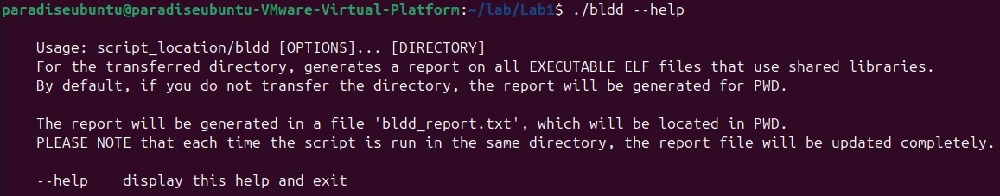
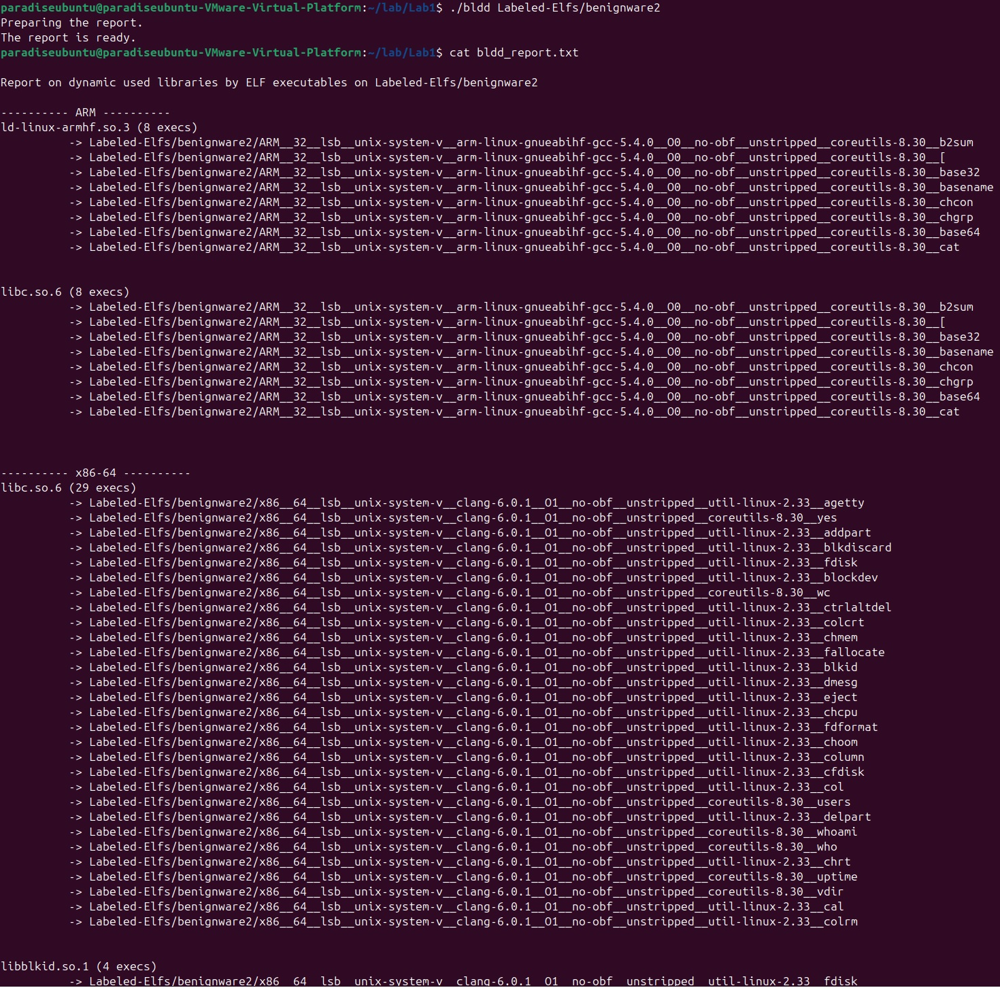

# ELF files

### Task:
---
- Изучите как работает утилита ldd
- Реализуйте приложение под названием bldd (обратный ldd) – которое показывает все ИСПОЛНЯЕМЫЕ файлы, 
  использующие указанные файлы разделяемых библиотек. Смотри пример.
- Приложение должно быть настраиваемым (например, возможность указать сканируемую директорию)
- Приложение должно генерировать отчёт в качестве вывода (txt, pdf и т.д.) – может быть реализовано с использованием
  любых языков и библиотек.
- Отчёт должен быть отсортирован по количеству использований исполняемых файлов (высокое -> низкое). Смотри пример.
- Приложение должно принимать библиотеки как минимум следующих архитектур: x86, x86_64, armv7, aarch64. 
  (должно быть архитектурно-зависимым)
- Приложение должно иметь help с примерами использования.
---
### Example:
```bash
Report on dynamic used libraries by ELF executables on /home

---------- i386 (x86) ----------
libc.so.0.1 (1 execs)
	-> /home/inno/QEMU/buildroot-2022.02.1/output/build/host-patchelf-0.9/tests/no-rpath-prebuild/no-rpath-kfreebsd-i386

libc.so.0.3 (1 execs)
	-> /home/inno/QEMU/buildroot-2022.02.1/output/build/host-patchelf-0.9/tests/no-rpath-prebuild/no-rpath-hurd-i386

libc.so.6 (1 execs)
	-> /home/inno/QEMU/buildroot-2022.02.1/output/build/host-patchelf-0.9/tests/no-rpath-prebuild/no-rpath-i386

------------ x86-64 ------------
libc.so.6 (681 execs)
	-> /home/inno/QEMU/buildroot-2022.02.1/output/build/host-gmp-6.2.1/gen-psqr
	-> /home/inno/QEMU/buildroot-2022.02.1/output/build/host-gmp-6.2.1/gen-fib
	-> /home/inno/QEMU/buildroot-2022.02.1/output/build/host-gmp-6.2.1/gen-trialdivtab
	-> /home/inno/QEMU/buildroot-2022.02.1/output/build/host-gmp-6.2.1/gen-fac
	-> /home/inno/QEMU/buildroot-2022.02.1/output/build/host-gmp-6.2.1/gen-bases
	-> /home/inno/QEMU/buildroot-2022.02.1/output/build/host-gmp-6.2.1/gen-jacobitab
```
### Solution:
В качестве решения был написан небольшой bash скрипт. Последовательность шагов следующая. Находим все исполняемые ELF
файлы, в переданной директории. Просматриваем их утилитой readelf, вытаскиваем Shared libraries, которые они используют,
далее составляем две map arch_lib_file_map и arch_lib_file_count_map, в качестве ключа для обоих map используем 
arch:lib, где - arch это архитектура, lib - название самой shared library. arch_lib_file_map хранит пути ко всем файлам,
которые используют данную библиотеку, arch_lib_file_count_map хранит counter того, сколько файлов используют данную
shared library. 
```bash
while read -r file; do
    if readelf -a "${file}" | grep -q "Shared library"; then
        arch=$(file "${file}" | awk -F, '{sub(/^ */, "", $2); print $2}')
        while read -r lib; do
            arch_lib_file_map["${arch}:${lib}"]+="${file}\n"
            (( arch_lib_file_count_map["${arch}:${lib}"]++ ))
        done < <(readelf -a "$file" | grep "Shared library" | grep -oP '\[\K[^]]+(?=])')
    fi
done < <(find "${DIR}" -type f -executable -print0 | xargs -0 file | grep -E "ELF.*executable" | awk -F: '{print $1}')

```
Далее остается лишь пробежаться по arch_lib_file_count_map отсортировав её по архитектурам в алфавитном порядке и 
по количеству используемых библиотек по убыванию, и затем вывести все в нужном нам виде записав это, например 
в .txt файл.
```bash
for key in "${!arch_lib_file_count_map[@]}"; do
    IFS=':' read -r arch lib <<< "$key"
    echo "${arch} ${lib} ${arch_lib_file_count_map[${key}]}"
done | sort -k1,1 -k3,3nr |
while read -r arch lib value; do
    if [[ "${arch}" != "${current_arch}" ]]; then
        echo -e "\n---------- ${arch} ----------"
        current_arch="${arch}"
    fi
    echo "${lib} (${value} execs)" 
    echo -e "${arch_lib_file_map["${arch}:${lib}"]}" | while IFS= read -r file; do
        if [[ -n "${file}" ]]; then
            echo "          -> ${file}"
        fi
    done
    echo -e "\n"
done >> "${PWD}/bldd_report.txt"
```
### Launch example:




### Notes:
- Полный код находится в файле bldd.
- Так как код немного неоптимизирован на больших директориях может работать достаточно долго!
