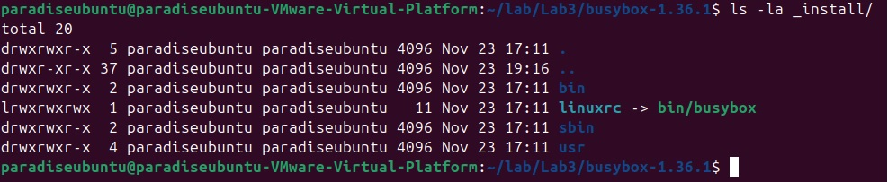
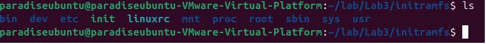
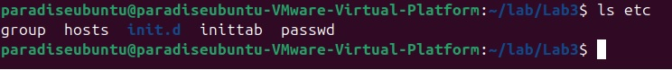
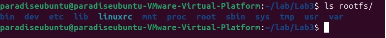
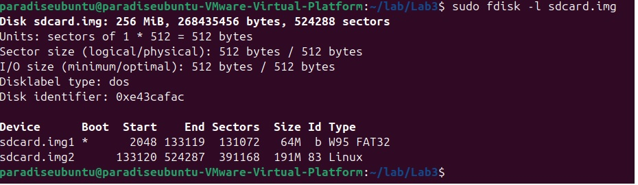
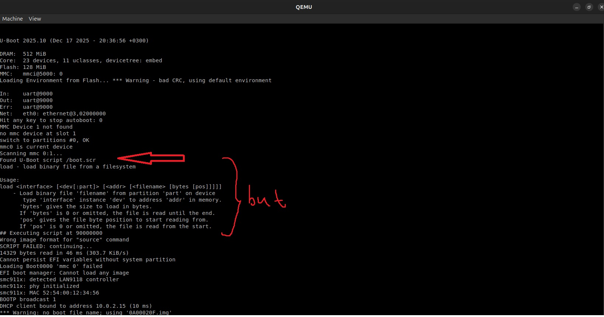
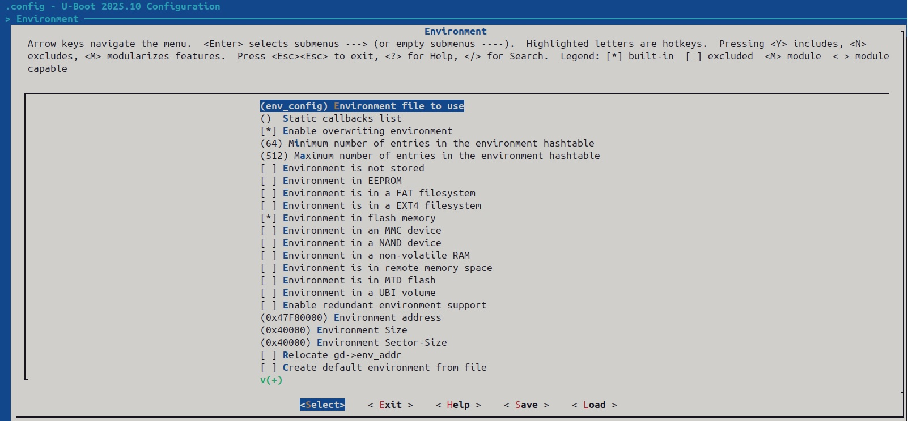
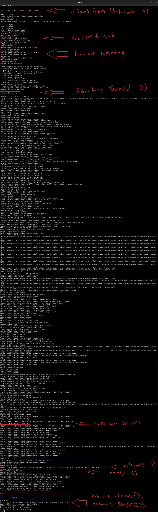

# Loading the system

### Preparatory steps:
---
* Настройка среды разработки:
  * Установите пакеты git и qemu-system-arm
  * Загрузите исходные коды стабильной (stable) версии ядра Linux
  * Загрузите исходные коды загрузчика первого этапа (любого из u-boot, coreboot и др.)
  * Загрузите встраиваемый набор UNIX-программ (busybox, u-root и др.)
  * Загрузите GNU кросс-компилятор (cross toolchain)
---

### Task:
---
* Для цели qemu vexpress-a9:
  * Соберите загрузчик для архитектуры ARM (u-boot, coreboot и др.)
  * Подготовьте initrd/initramfs (busybox, u-root и др.)
  * Подготовьте rootfs (также может быть сделано с помощью busybox, u-root и др.)
  * Соберите стабильную (stable) версию Linux
  * Запустите всё в qemu
  * Загрузитесь в rootfs, используя последовательность загрузки: загрузчик → ядро → initramfs → rootfs (важно!)
---
### Solution:
---
#### Build u-boot
Клонируем репозиторий U-boot и извлекаем последнюю стабильную версию:
```bash
git clone https://github.com/u-boot/u-boot/ 
git checkout v2025.10
```
Компилируем u-boot для платы разработки vexpress (также можно создавать дополнительные конфигурации, далее мы этим
воспользуемся):
```bash
export ARCH=arm
export CROSS_COMPILE=arm-linux-gnueabihf-
make -j2 vexpress_ca9x4_defconfig
make -j2
```

Проверяем, работает ли образ u-boot:

```bash
qemu-system-arm -M vexpress-a9 -kernel u-boot -m 512M
```
---
#### Build initramfs from busybox
Скачиваем и распаковываем stable версию busybox

```bash
wget https://busybox.net/downloads/busybox-1.36.1.tar.bz2
tar -xjf busybox-1.36.1.tar.bz2
```
Переходим в папку с busybox и через ```make menuconfig``` включаем статическую линковку:
*Settings -> Build options -> Build static binary (no shared libs)*.
Так как мы уже установили ```export ARCH=arm``` и  ```export CROSS_COMPILE=arm-linux-gnueabihf-```, то просто собираем 
busybox:
```bash
make -j2 && make -j2 CONFIG_PREFIX=/path/to/install/busybox  install
```
Получаем папочку с следующим содержанием:

Далее её нужно просто дополнить нужными нам директориями, например dev, etc, mnt/root, proc, root, sys:
```bash
mkdir --parents {dev,etc,mnt/root,proc,root,sys} 
```
Более подробно о том, как создать сustom initramfs можно почитать [*тут*](https://wiki.gentoo.org/wiki/Custom_Initramfs "Сustom initramfs").
Далее в этой же директории нужно будет создать простой **init** скрипт:
```bash
#!/bin/busybox sh
/bin/busybox --install -s /bin

echo "Hello from initramfs!"

mount -t proc none /proc
mount -t sysfs none /sys
mount -t devtmpfs none /dev

mdev -s

mount -o ro /dev/mmcblk0p2 /mnt/root

umount /proc /sys
mount --move /dev /mnt/root/dev

exec switch_root /mnt/root /sbin/init
```
По сути все что он делает, это временно монтирует директории /proc, /sys, /dev. Однако, основной задачей скрипта 
является монтирование /dev/mmcblk0p2 (раздел sd диска на котором будет находится основаня файловая система - rootfs)
в качестве root. Инструкция ```exec switch_root``` как раз таки переключает нас с ramdisk на смонтированную
файловую систему и запускает первый процесс **/sbin/init**.

Содержание initramfs теперь выглядит так:


Осталось лишь упаковать все это в .img и оставить, чтобы в дальнейшем закинуть initramfs.img в загрузочный раздел 
sd карты:
```bash
find . -print0 | cpio --null --create --verbose --format=newc | gzip --best > /boot/custom-initramfs.cpio.gz 
mkimage -A arm -T ramdisk -C none -d custom-initramfs.cpio.gz initramfs.img
```

---
#### Build rootfs from busybox
rootfs создается по аналогии с initramfs за тем исключением, что нужно ещё будет закинуть туда модули ядра 
(поэтому оно уже должно быть собрано к этому моменту). Более подробные инструкции по сборке rootfs можно найти
[*тут*](https://habr.com/ru/articles/681738/ "Разработка драйвера сетевого адаптера для Linux. Часть 1") и
[*тут*](https://medicineyeh.wordpress.com/2016/03/29/buildup-your-arm-image-for-qemu/ "Build Your ARM Image for QEMU").

Я же просто оставлю здесь простой скрипт для сборки rootfs (см. mkrootfs):
```bash
#!/bin/bash
 
#Remove old files
if [[ -d rootfs ]]; then
  sudo rm -rf rootfs
fi
if [[ -d tmpfs ]]; then
  rmdir tmpfs
fi

if [[ -f a9rootfs.ext3 ]]; then
  rm -f a9rootfs.ext3
fi
 
#Create new rootfs folder
sudo mkdir rootfs
sudo cp /home/paradiseubuntu/lab/Lab3/"busybox-1.36.1"/_install/* rootfs/ -raf
 
#Create folders required by Linux convention
sudo mkdir -p rootfs/proc/
sudo mkdir -p rootfs/sys/
sudo mkdir -p rootfs/tmp/
sudo mkdir -p rootfs/root/
sudo mkdir -p rootfs/var/
sudo mkdir -p rootfs/mnt/

sudo cp /home/paradiseubuntu/lab/Lab3/etc rootfs/ -arf

cd /home/paradiseubuntu/lab/Lab3/"linux-6.17.3"
sudo make -j2 INSTALL_MOD_PATH=/home/paradiseubuntu/lab/Lab3/rootfs modules_install
cd /home/paradiseubuntu/lab/Lab3/

#Copy shared libraries to rootfs
sudo cp -arf /usr/arm-linux-gnueabihf/lib rootfs/
sudo rm rootfs/lib/*.a
sudo arm-linux-gnueabihf-strip rootfs/lib/*
 
#Create basic device nodes
sudo mkdir -p rootfs/dev/
sudo mknod rootfs/dev/tty1 c 4 1
sudo mknod rootfs/dev/tty2 c 4 2
sudo mknod rootfs/dev/tty3 c 4 3
sudo mknod rootfs/dev/tty4 c 4 4
sudo mknod rootfs/dev/console c 5 1
sudo mknod rootfs/dev/ttyAMA0 c 204 64
sudo mknod rootfs/dev/null c 1 3
```
В строке ```sudo cp /home/paradiseubuntu/lab/Lab3/etc rootfs/ -arf``` в rootfs была скопирована директория etc 
следующего содержания:


Её создание можно более подробно посмотреть [*здесь*](https://habr.com/ru/articles/681738/ "Разработка драйвера сетевого адаптера для Linux. Часть 1").
В целом, можно обойтись и без этого, суть в том, что в /etc/init.d/ лежит скрипт rc.S:
```bash
#!/bin/sh

echo "Hello from rootfs!"

HOSTNAME=zero
VERSION=0.0.1
hostname $HOSTNAME
mount -n -t proc proc /proc
mount -n -t sysfs sysfs /sys
mount -n -t tmpfs mdev /dev
mdev -s

# Set PATH
export PATH=/bin:/sbin:/usr/bin:/usr/sbin:/usr/local/bin

# Start other daemons
/sbin/syslogd
```
который просто немного доинициализирует rootfs, уже после того как был выполнен ```exec switch_root```.
Данный скрипт будет выполнен процессом **/sbin/init**.

В итоге, готовая директория rootfs выглядит как-то так:


Её содержание, чуть позже, просто целиком и полностью переносится на второй раздел sd карты. 

---
#### Build Linux kernel
Качаем stable версию с [*The Linux Kernel Archives*](https://www.kernel.org/ "The Linux Kernel Archives").
Распаковываем и собираем для платы vexpress:
```bash
tar -xvf linux-6.17.3.tar.xz

export ARCH=arm
export CROSS_COMPILE=arm-linux-gnueabihf-
make -j2 vexpress_defconfig
make -j2 zImage
make -j2 modules
make -j2 dtbs
```

Можно проверить собранное ядро в qemu:
```bash
sudo qemu-system-arm -M vexpress-a9 -m 512M -kernel arm/boot/zImage \
-append "console = ttyAMA0“ -dtb arch/arm/boot/dts/vexpress-v2p-ca9.dtb
```

---
#### Creating a bootable sd card
Создадим пустой образ sd карты на 256М:
```bash
dd if=/dev/zero of=sdcard.img bs=1M count=256
```
Более подробно о том, как разбить sd карту на партиции и перекинуть туда все что нужно можно почитать 
[*тут*](https://linuxlink.timesys.com/docs/gsg/beaglebone#SECTION00064000000000000000 "Timesys Getting Started Guide for TI BeagleBone").

А здесь я просто приведу общее flow:
```bash
dd if=/dev/zero of=sdcard.img bs=1M count=256

sudo fdisk sdcard.img # последовательность команд внутри fdisk (o, (n, p, 1, +64M), t, a, (n, p, 2), w) 
# или можно просто parted sdcard.img --script -- mklabel msdos mkpart primary fat32 1MiB 64MiB mkpart primary ext4 64MiB 255MiB
     
sudo fdisk -l sdcard.img 

sudo mkdir -p /mnt/bootfs
sudo mkdir -p /mnt/rootfs

sudo losetup -D
sudo losetup -f --show sdcard.img
sudo kpartx -av /dev/loopX
lsblk

sudo mkfs.vfat -v -c -F 32 -n BOOT /dev/mapper/loopXp1
sudo mkfs.ext4 -L rootfs /dev/mapper/loopXp2
```
В *loopX* вместо X подставляем то значение, которое вернёстся после ```sudo losetup -f --show sdcard.img```.
Таким образом, после всех манипуляций получаем sdcard.img который выглядит следующим образом:


Первый сектор загрузочный туда мы бросаем **zImage** и **dtb**, которые мы получили при сборке ядра, **initramfs.img**, который
мы уже подготовили, а так же загрузочный скрипт **boot.scr** для U-boot, о котором речь пойдет чуть позже. Во втором же секторе просто размещаем так же
ранее подготовленный **rootfs**. Ну и не забываем записать в самое начало сам загрузчик u-boot:
```sudo dd if=/home/paradiseubuntu/lab/Lab3/u-boot/u-boot.bin of=/dev/loopX conv=fsync bs=1024 seek=2```
```bash
sudo mount /dev/mapper/loopXp1 /mnt/bootfs
sudo mount /dev/mapper/loopXp2 /mnt/rootfs

sudo cp /home/paradiseubuntu/lab/Lab3/linux-6.17.3/arch/arm/boot/zImage /mnt/bootfs/
sudo cp /home/paradiseubuntu/lab/Lab3/initramfs.img /mnt/bootfs/
sudo cp /home/paradiseubuntu/lab/Lab3/linux-6.17.3/arch/arm/boot/dts/arm/vexpress-v2p-ca9.dtb /mnt/bootfs/
sudo cp boot.scr /mnt/bootfs/

sudo cp -r /home/paradiseubuntu/lab/Lab3/rootfs/* /mnt/rootfs/

sudo dd if=/home/paradiseubuntu/lab/Lab3/u-boot/u-boot.bin of=/dev/loopX conv=fsync bs=1024 seek=2

sudo umount /dev/mapper/loopXp1
sudo umount /dev/mapper/loopXp2
```
Вот и все наша sd card готова. 

---
#### boot.scr and U-boot environment variable
**boot.scr** - это файл файл сценария, который получается из обычного текстового файла, например из 
boot.cmd при помощи утилиты mkimage: ```mkimage -C none -A arm -T script -d boot.cmd boot.scr```.
В этом файле мы можем указать откуда, что и куда должен вгрузить u-boot, так же можно проинициализировать любые 
другие environment variable U-boot и т.д. Иными словами **boot.scr** позволяет автоматизировать процесс загрузки.

В моём случае, этот скрипт выглядит следующим образом (его так же можно будет найти в исходниках):
```bash
echo "Hello from boot.scr"

echo "Загружаю zImage..."
fatload mmc 0:1 0x62000000 zImage
echo "zImage успешно загружен!"

echo "Загружаю initramfs.img..."
fatload mmc 0:1 0x63000000 initramfs.img
echo "initramfs.img успешно загружен!"

echo "Загружаю dtb..."
fatload mmc 0:1 0x64000000 vexpress-v2p-ca9.dtb
echo "dtb успешно загружен!"

echo "Настраиваю env var..."
setenv bootargs console=ttyAMA0 rootwait rw
echo "env var успешно настроены"

echo "Поехали!"
bootz 0x62000000 0x63000000 0x64000000
```
Детально, какая команда за что отвечает можно почитать в [*официальной документации U-boot*](https://docs.u-boot.org "The U-Boot Documentation").
Если кратко, то мы просто загружаем zImage, initramfs.img и dtb в свободные адреса и командой bootz стартуем 
загрузку ядра Linux.

**boot.scr** нужно размещать либо в / (что мы и сделали) либо в директории /boot загрузочного сектора. Имеено там их
будет искать U-boot по умолчанию. И все бы ничего, казалось можно запускать все командой:
```bash
qemu-system-arm -M vexpress-a9 -m 512M -kernel u-boot -drive if=sd,driver=file,filename=/home/paradiseubuntu/lab/Lab3/sdcard.img
```
и дело в шляпе, но, увы, мы получим следующее сообщение об ошибке:

Т.е., U-boot увидел наш скрипт об этом нам говорит строка **Found U-Boot script /boot.scr**, но затем мы получаем 
уведомление о том как нужно использовать команду load и ошибку **Wrong image format for 'source' command**.

Так произошло, потому что environment variable **boot_a_script**, которая по умолчанию задается как:
```bash
boot_a_script=load ${devtype} ${devnum}:${distro_bootpart} ${scriptaddr} ${prefix}${script}; source ${scriptaddr}
```
не проинициализирована, иными словами значения переменных devtype, devnum, distro_bootpart, scriptaddr, prefix, script
не установлены по умолчанию, по крайней мере для весрии U-boot 2025.10. Поэтому мы и получаем данную ошибку. 

Кстати, посмотреть все environment variable можно прописа ```printenv```, а значение конкретной переменной через
```printenv env_name```.

Так как же быть?! Есть несколько вариантов, чтобы задать значения для environment variable в U-boot. 

Вот как минимум 3 из них:
1. Подправить CFG_EXTRA_ENV_SETTINGS в файле u-boot/include/configs/board_name.h
2. Создать файл <CONFIG_ENV_SOURCE_FILE>.env и поместить его в u-boot/board/\<vendor>/\<board>/ и указать при сборке 
   CONFIG_ENV_SOURCE_FILE or CONFIG_SYS_BOARD название этого файла.
3. При помощи утилиты u-boot/tools/mkenvimage создать env blob file из обычного my_env.txt и запихнуть его во флэш память 
   учитывая CONFIG_ENV_ADDR и CONFIG_ENV_SIZE / CONFIG_ENV_SECT_SIZE or CONFIG_ENV_OFFSET
   
Лучше пойти самым простым (2) путем и создать файл, например env_config.env следующего содержания:
```bash
devtype=mmc
devnum=0
distro_bootpart=1
scriptaddr=0x61000000
script=boot.scr
```
где мы и доинициализируем так не достающие нам значения env var. Далее нужно просто закинуть этот файл в директорию с
board, т.е., в данном случае в *u-boot/board/armltd/vexpress* и пересобрать U-boot как это было описано в разделе 
**Build u-boot**, за тем маленьким исключением, что теперь после ```make -j2 vexpress_ca9x4_defconfig``` нужно ещё
сделать ```make menuconfig``` и в Environment ---> Environment file to use прописать наш файл env_config, чтобы установить
<CONFIG_ENV_SOURCE_FILE>:

Всё, сохраняем, и снова собираем ```make -j2 ```.

--- 
### Launch example:
Вот теперь то точно можно запускать все командой:
```bash
qemu-system-arm -M vexpress-a9 -m 512M -kernel u-boot -drive if=sd,driver=file,filename=/home/paradiseubuntu/lab/Lab3/sdcard.img
```
и радоваться жизни:


Как видно теперь мы успешно загрузились в **rootfs** соблюдая последовательность загрузки: 
**загрузчик → ядро → initramfs → rootfs**.

### Notes:
Директорию etc, скрипт boot.cmd, init, mkrootfs можно найти в текущем репозитории в папке sources files.