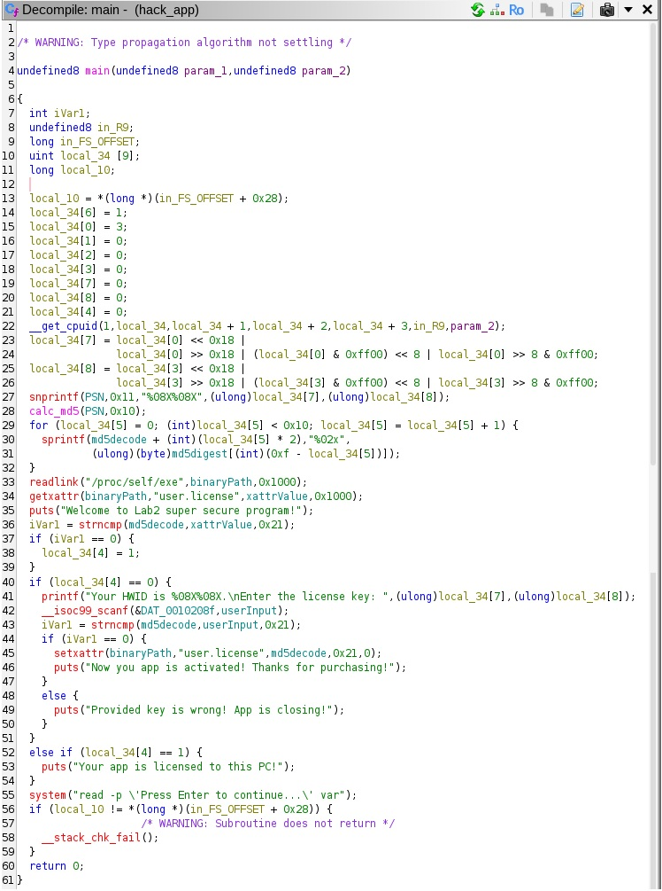
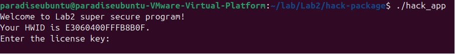
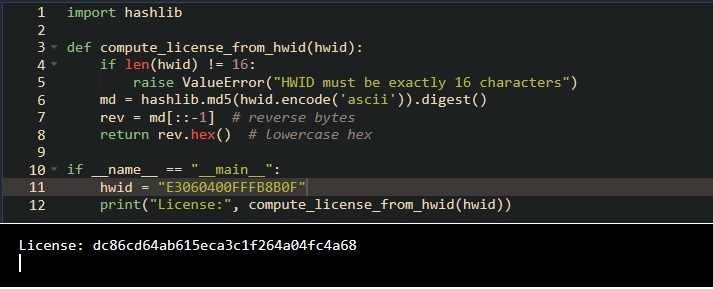
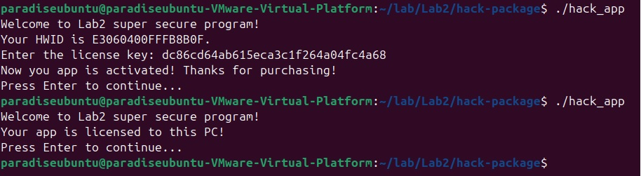
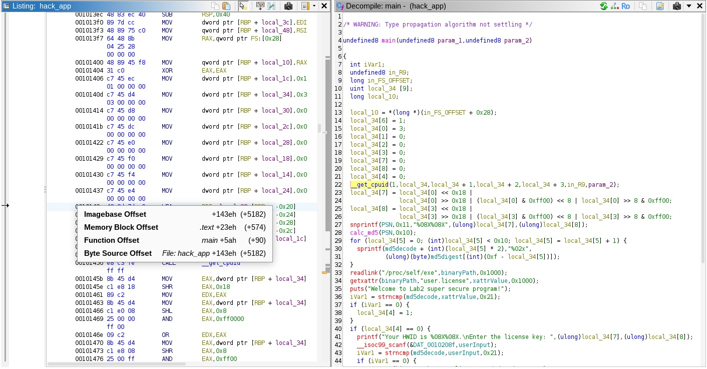
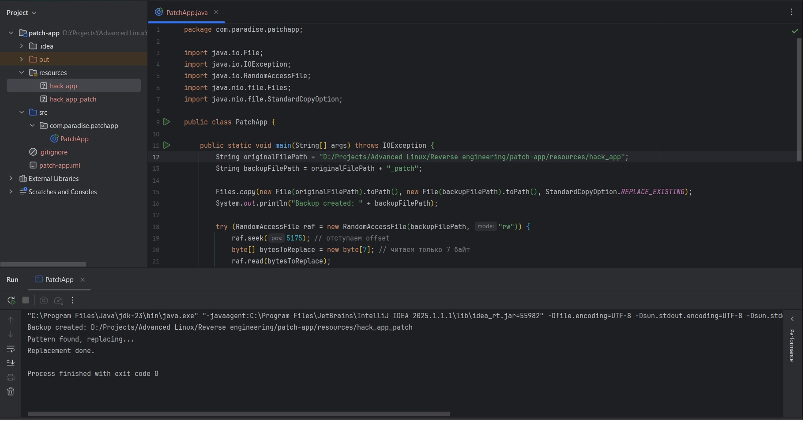
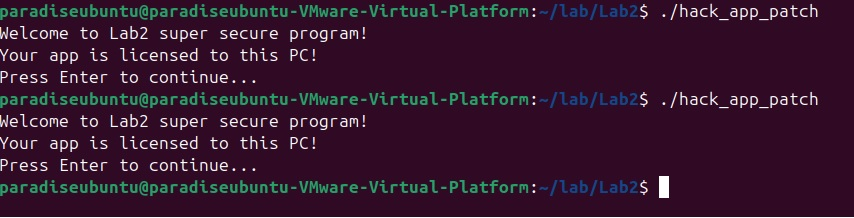
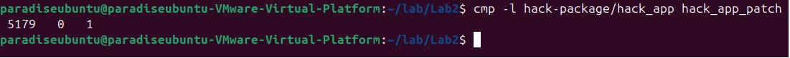
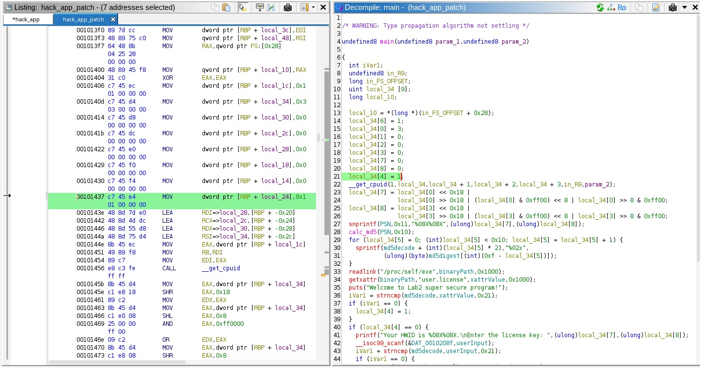

# Reverse engineering

### Task:
---
- Изучите утилиты: GDB, strace, GHIDRA, ldd.
- «Взломайте» приложение, предоставленное преподавателем!
- Приложение требует лицензию, которая генерируется на основе идентификатора вашего оборудования.
- Лицензия будет храниться где-то на вашем ПК (в файловой системе).

* Реализуйте 2 артефакта:
  * Создайте генератор ключей (keygen) для этого приложения.
  * Создайте бинарный патч для полного отключения лицензирования.
---
### Solution:
Для начала накатим [*GHIDRA*](https://github.com/NationalSecurityAgency/ghidra "Go to GHIDRA") и декомпилируем исходное
приложение. 

*Decompile code (main function):*



Как видно на основе CPUID вычисляются две переменные *local_34[7]* и *local_34[8]*, далее из каждой берется по 8 символов в
шестнадцатеричной системе в врехнем регистре, и все это записывается в PSN, на основе которого уже вычисляется md5 hash
('\0' не включается). 
```C
__get_cpuid(1,local_34,local_34 + 1,local_34 + 2,local_34 + 3,in_R9,param_2);
local_34[7] = local_34[0] << 0x18 |
             local_34[0] >> 0x18 | (local_34[0] & 0xff00) << 8 | local_34[0] >> 8 & 0xff00;
local_34[8] = local_34[3] << 0x18 |
             local_34[3] >> 0x18 | (local_34[3] & 0xff00) << 8 | local_34[3] >> 8 & 0xff00;
snprintf(PSN,0x11,"%08X%08X",(ulong)local_34[7],(ulong)local_34[8]);
calc_md5(PSN,0x10);
```
В итоге результат попадает в *md5digest*. Затем в цикле порядок байт *md5digest* реверсируется и в нижнем регистре
записывается в *md5decode*. 
```C
for (local_34[5] = 0; (int)local_34[5] < 0x10; local_34[5] = local_34[5] + 1) {
    sprintf(md5decode + (int)(local_34[5] * 2),"%02x",
            (ulong)(byte)md5digest[(int)(0xf - local_34[5])]);
}
```
После чего при помощи *getxattr* значение полученное из *user.license* в переменную 
*xattrValue* сравнивается с *md5decode*, а результат сравнения попадает в *iVar1*.
```C
readlink("/proc/self/exe",binaryPath,0x1000);
getxattr(binaryPath,"user.license",xattrValue,0x1000);
puts("Welcome to Lab2 super secure program!");
iVar1 = strncmp(md5decode,xattrValue,0x21);
``` 
Разумеется, при первом запуске или если лицензия не активирована *iVar1* не будет равна 0. 
Поэтому мы попадаем на условие  ```if (local_34[4] == 0)```, где нам предлагают ввести ключ, который потом вновь 
сравнивается с *md5decode*, результат сравнения перезаписывается в *iVar1* и если все совпало, то *setxattr* запишет
*md5decode* в *user.license*, чтобы в следующий раз не спрашивать ключ. 
```C
if (local_34[4] == 0) {
    printf("Your HWID is %08X%08X.\nEnter the license key: ",(ulong)local_34[7],(ulong)local_34[8]);
    __isoc99_scanf(&DAT_0010208f,userInput);
    iVar1 = strncmp(md5decode,userInput,0x21);
    if (iVar1 == 0) {
        setxattr(binaryPath,"user.license",md5decode,0x21,0);
        puts("Now you app is activated! Thanks for purchasing!");
    }
    else {
        puts("Provided key is wrong! App is closing!");
    }
} else if (local_34[4] == 1) {
    puts("Your app is licensed to this PC!");
}
```

--- 
**Keygen**

Чтобы реализовать свой генератор достаточно заметить, что в строке 
```C
printf("Your HWID is %08X%08X.\nEnter the license key: ",(ulong)local_34[7],(ulong)local_34[8]);
```
в качетсве HWID мы получаем значения *local_34[7]* и *local_34[8]*, т.е., тех самых переменных, на основе которых
был вычислен md5 hash. Причем они уже выведены в точно таком же формате ```%08X%08X``` как и при
вычислении hash. А значит все что нужно, это взять HWID посчитать на его основе md5 hash, реверсировать порядок,
перевести всё в нижний регистр и скормить программе. 

**Простое решение на Python с ипользованием библиотечки hashlib:**
```Python
import hashlib

def compute_license_from_hwid(hwid):
    if len(hwid) != 16:
        raise ValueError("HWID must be exactly 16 characters")
    md = hashlib.md5(hwid.encode('ascii')).digest()
    rev = md[::-1]  # reverse bytes
    return rev.hex()  # lowercase hex
```
Полный код в keygen_license.py.
#### Launch example:

Запустим приложение:


Бросаем HWID нашей keygen_license.py и получаем заветный ключик:


Вводим полученный ключ и радуемся жизни (как видно второй перезапуск уже не просит ключ):


--- 
**Patch**

Чтобы создать бинарный патч есть множество путей, пойдем одним из самых простых, а именно просто перепишем значение 
переменной *local_34[4]* которая проверяется в ```if (local_34[4] == 0)``` с 0 на 1, так как в начале
она проинициализирована 0 (```local_34[4] = 0```). Таким образом, мы сразу попадем в else if с сообщением 
об уже активированном приложении, минуя тем самым запрос ключа.
```C
else if (local_34[4] == 1) {
    puts("Your app is licensed to this PC!");
}
```
Всё что нужно это снова воспользоваться [*GHIDRA*](https://github.com/NationalSecurityAgency/ghidra "Go to GHIDRA"), 
чтобы посмотреть на сколько байт нам нужно оступить, чтобы попасть в нужную строку:
![local_34[4] offset](screenshots/offset_local_34.jpg "local_34[4] offset")

Так же, чтобы понять сколько байт нужно считать, можно проверить offset следующей строки, т.е., строки
с функцией *__get_cpuid*:


Как видно, достаточно отступить 5175 байт и считать всего 7, чтобы получить строку ```local_34[4] = 0```, которая 
имеет вид c7 45 e4 00 00 00 00. Дальше нужно просто заменить 00 00 00 00 на 01 00 00 00 и патч готов.
Реализация была написана на Java, код можно посмотреть в patch-app/src/com/paradise/patchapp/PatchApp.java.
#### Launch example:

Запускаем наш PatchApp.java получаем пропатченный hack_app_patch:


Проверяем что всё работает:


Таким образом, нам удалось полностью отключить лицензирование. 

--- 
### Notes:
Интереса ради можно проверить что мы действительно поменяли только 1 байт, для этого можно выполнить
команду ```cmp -l``` с флагом ```-l``` и передать ей исходный и пропатченный бинарные файлы.
Таким образом, мы увидим позицию и отличие в ней:


Как видно, действительно, есть только различие в 1 байт.
Так же, при помощи все той же [*GHIDRA*](https://github.com/NationalSecurityAgency/ghidra "Go to GHIDRA") можно было бы
декомпилировать пропатченный бинарь и убедиться, что теперь там стоит ```local_34[4] = 1``` и c7 45 e4 01 00 00 00:
